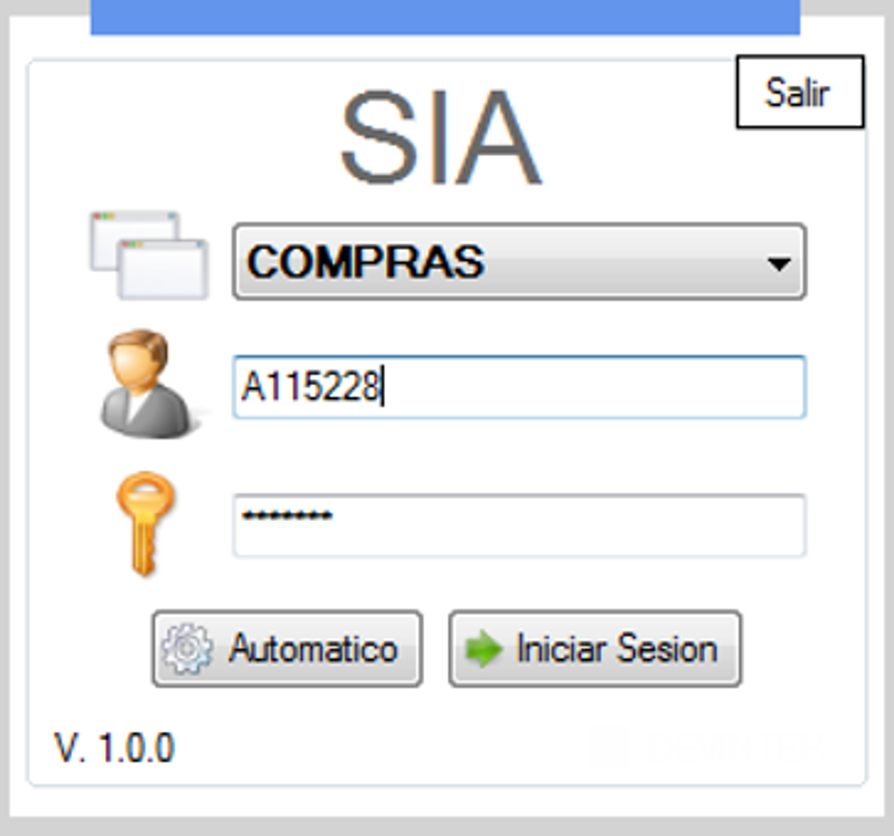
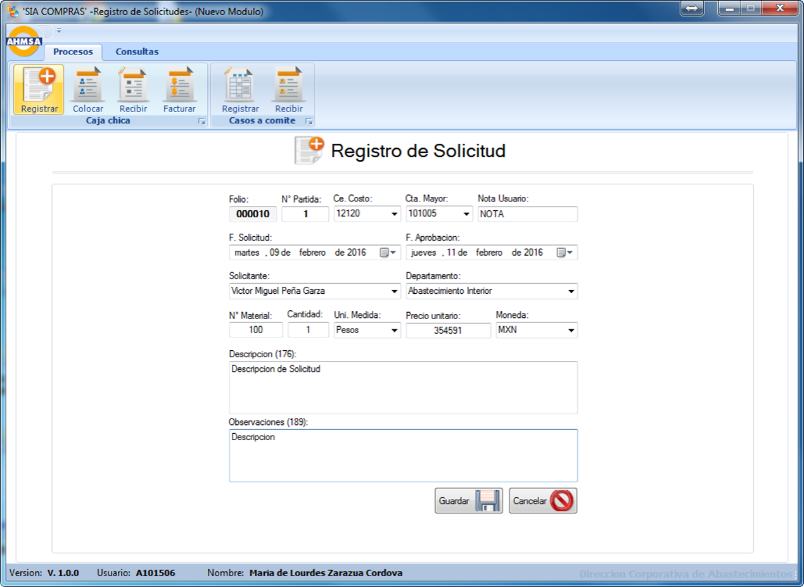
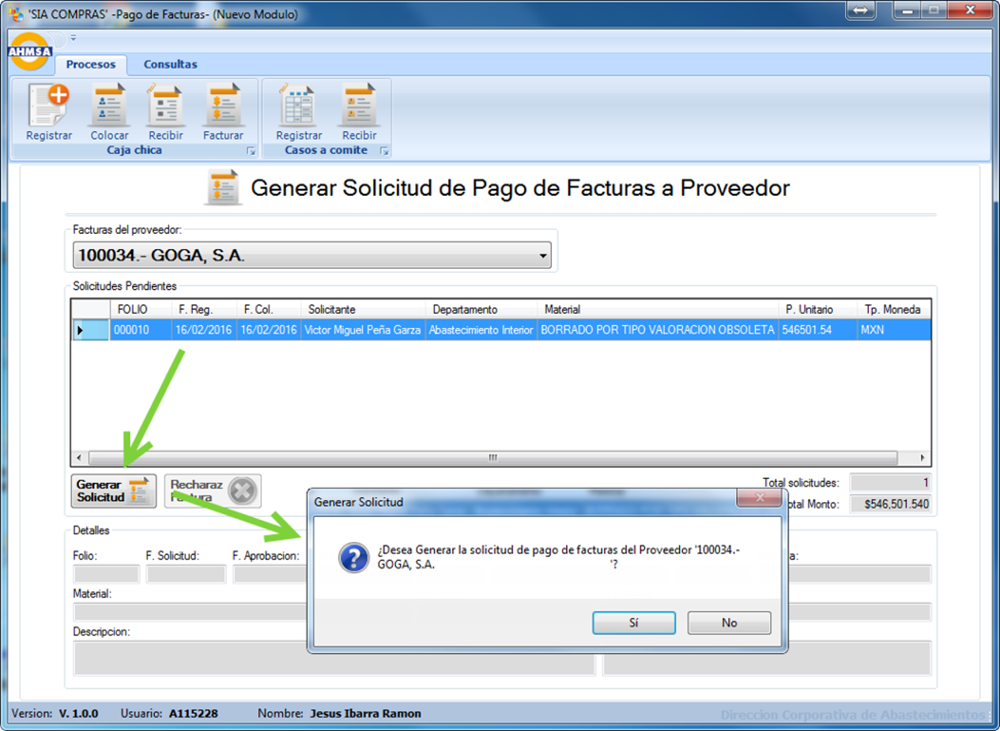
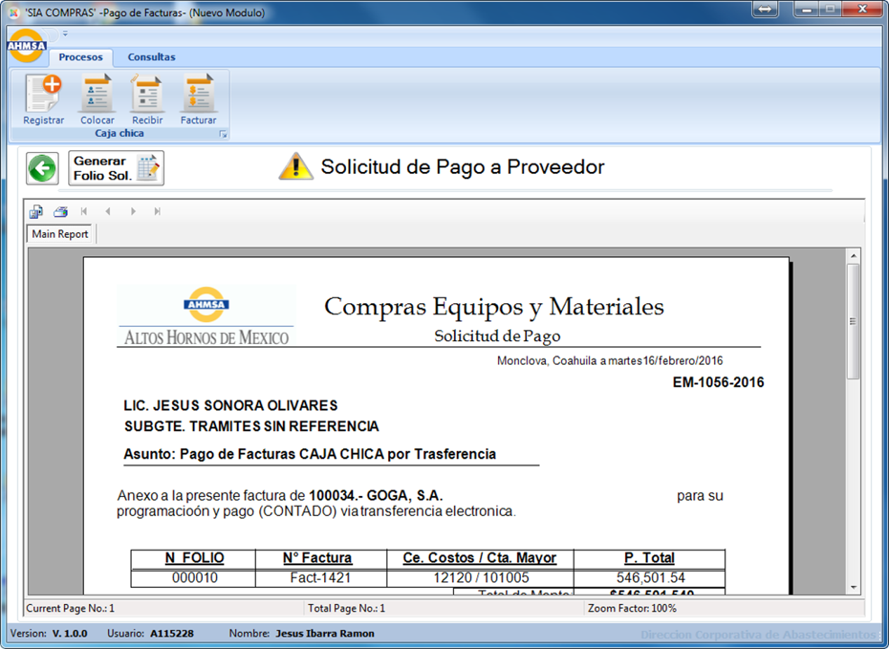

# 💵 SIA – Petty Cash Module

## 🧭 Overview
The **Petty Cash Module** is part of the **SIA (Sistema Integral de Abastecimientos)** platform, developed using **C#**, **SQL Server**, and **Visual Studio**. This module was designed to streamline and digitize the petty cash workflow at AHMSA, handling purchases under 5,000 MXN through a secure and traceable system.

Replacing spreadsheets and email-driven processes, this application ensures proper documentation, transparency, and faster processing for small procurement cases.

### Login

### Register Purchase Order

### Generate Pay App

## 💡 Idea & Concept
Previously, petty cash purchases were tracked using manual Excel logs with high chances of:
- Data entry errors
- Lost history or duplicate entries
- No approval traceability

This module digitizes all steps in the petty cash flow: request, assign, receive, and payment application.

## ✨ Features & Functionality
- 📝 **Purchase Request Registration**:
  - Auto-generated request ID
  - Fields: requester, department, cost code, account number, date, quantity, unit, currency, price, item description, notes
  - Sends automated email notifications

- 🔄 **Assignment of Purchase Request**:
  - Search vendor by vendor number
  - Assign vendor to request via dropdown and validation screen

- 📥 **Invoice Reception**:
  - Grid with list of assigned requests
  - Mark request as received and attach vendor invoice info

- 💳 **Payment Application Generation**:
  - Vendor dropdown
  - Generates Crystal Report-style PDF with vendor details and all pending requests
  - Summary sheet sent to the payment team

## ⚙️ Tech Stack
| **Frontend**            |  |
| **Backend**             |  |
| **Platform**            |  |
| **Framework**           |  |
| **IDE**                 |  |
| **Database**            |  |
| **Cloud & Hosting** |   |
| **Security & Identity** |  |
| **Other**               |   |

## 🏗 Architecture & Design
- Integrated under the SIA RibbonBar with embedded form tabs
- Role-based access: purchasers, assistants, reviewers
- Transactions and audit logging for compliance
- Auto-start and singleton instance enforcement

## 🚀 Installation & Setup
- **Environment:** Internal Windows desktops
- **Startup:** Auto-start and pinned to taskbar
- **Access:** Role and credential controlled

> **Note:** The system checks for active updates and can force-close outdated sessions.

## 🧑‍💻 My Role & Contributions
- 💼 Full-stack design and development
- 📐 Database schema design for tracking and approvals
- 🔧 Embedded reporting and Crystal integration
- 📤 Email and notification setup

## 🧗 Challenges & Learnings
- Simplified a manual multi-user workflow into a cohesive UI
- Created audit trails and version management
- Designed a module to later scale to other internal departments

## 📈 Future Enhancements
- Web-based module integration
- Digital signatures for receipt acknowledgment
- Vendor performance tracking and auto-suggestions

## 🪪 License
⚠️ **Internal Use Only**  
Originally under MIT License. Changed to **CC BY-NC-ND 4.0** as of April 22, 2025.

## 🔗 Related Projects
- **[SIA](https://github.com/HermiloOrtega/SIA)**
- **[SIA – Petty Cash Module](https://github.com/HermiloOrtega/SIA-Petty-Cash)**
- **[SIA – Material Testing Module](https://github.com/HermiloOrtega/SIA-Material-Testing)**
